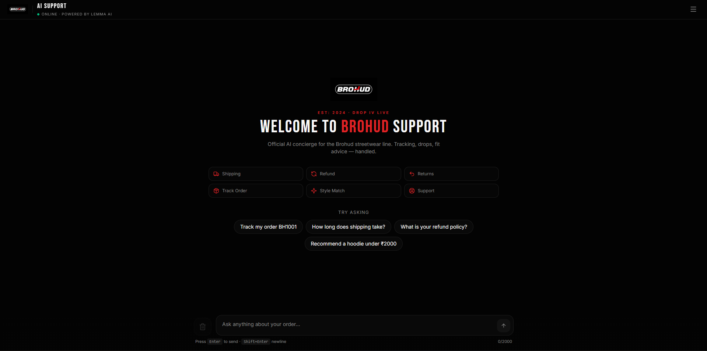

# Brohud AI Customer Support

An AI-powered customer support platform built for **Brohud**, a premium streetwear clothing brand. The application provides customers with instant assistance for shipping, returns, refunds, product recommendations, order tracking, and support requests through an intelligent conversational interface.

The project combines a modern React frontend with a FastAPI gateway and a Lemma AI backend to orchestrate workflows, retrieve knowledge, and execute custom functions.

---

## Live Demo

Frontend

https://your-vercel-url.vercel.app

Backend API

https://your-render-url.onrender.com/docs
## Preview

### Home Screen



---

## Features

- AI-powered customer support assistant
- Intelligent knowledge base retrieval
- Order tracking
- Product recommendations
- Shipping assistance
- Refund and return guidance
- Size guide support
- Support ticket creation
- Workflow orchestration using Lemma
- Responsive chat interface
- FastAPI API Gateway

---

# Architecture

```
                   User
                     │
                     ▼
           React + Vite Frontend
                     │
               REST API Request
                     │
                     ▼
             FastAPI API Gateway
                     │
                     ▼
              Lemma AI Platform
                     │
      ┌──────────────┼──────────────┐
      ▼              ▼              ▼
  AI Agent     Knowledge Base    Functions
      │              │              │
      └──────────────┴──────────────┘
                     │
                     ▼
              AI Generated Response
```

---

# Tech Stack

## Frontend

- React 19
- Vite
- TypeScript
- Tailwind CSS
- TanStack Router
- React Query
- Radix UI

## Backend

- Python
- FastAPI
- Uvicorn

## AI Platform

- Lemma
- AI Agent
- AI Workflows
- Knowledge Base
- Custom Functions

---

# Project Structure

```
brohudai/

├── frontend/
│
│   ├── components/
│   ├── hooks/
│   ├── routes/
│   ├── services/
│   ├── types/
│   └── ...
│
├── backend/
│
│   ├── app/
│   │
│   │   ├── api/
│   │   ├── config/
│   │   ├── models/
│   │   ├── services/
│   │   ├── utils/
│   │   └── main.py
│   │
│   └── brohud-ai-support/
│       ├── agents/
│       ├── functions/
│       ├── knowledge/
│       ├── workflows/
│       ├── tables/
│       └── pod.json
│
├── docs/
│
├── LICENSE
│
└── README.md
```

---

# AI Components

## Customer Support Agent

The AI agent is responsible for understanding customer requests and determining the most appropriate action.

Responsibilities include:

- Answering policy-related questions
- Tracking customer orders
- Recommending products
- Creating support tickets
- Escalating unsupported requests

---

## Knowledge Base

The assistant retrieves information from structured business documentation.

Available documents include:

- Shipping Policy
- Refund Policy
- Return Policy
- Frequently Asked Questions
- Product Catalog
- Size Guide

---

## Custom Functions

### Track Order

Returns the current delivery status of a customer order.

---

### Recommend Products

Suggests products based on customer preferences and budget.

---

### Create Support Ticket

Creates a support ticket when an issue requires manual assistance.

---

## Workflow

The customer support workflow coordinates the complete execution pipeline.

Workflow steps:

1. Receive customer message
2. Process request using the AI agent
3. Search the knowledge base
4. Execute custom functions if required
5. Generate the final response
6. Return the response to the frontend

---

# API Endpoints

## Health Check

```
GET /health
```

Returns the current status of the API Gateway.

---

## Chat

```
POST /chat
```

### Request

```json
{
    "message":"How long does shipping take?"
}
```

### Response

```json
{
    "success": true,
    "response": "...",
    "source": "lemma-cli",
    "timestamp": "...",
    "metadata": {}
}
```

---

# Getting Started

## Clone the Repository

```bash
git clone https://github.com/mouryatandasa/brohudai.git

cd brohudai
```

---

# Backend Setup

Create a virtual environment.

```bash
python -m venv .venv
```

Activate it.

### Windows

```bash
.venv\Scripts\activate
```

Install dependencies.

```bash
pip install -r requirements.txt
```

Run the FastAPI server.

```bash
python -m uvicorn app.main:app --reload
```

Backend URL

```
http://localhost:8000
```

Swagger Documentation

```
http://localhost:8000/docs
```

---

# Frontend Setup

Navigate to the frontend directory.

```bash
cd frontend
```

Install dependencies.

```bash
npm install
```

Create a `.env` file.

```env
VITE_API_URL=http://127.0.0.1:8000
```

Run the application.

```bash
npm run dev
```

---

# Sample Questions

Try asking questions like:

```
How long does shipping take?

Track my order BH1001.

Recommend a hoodie under ₹2000.

What is your refund policy?

I received a damaged product.

What size should I choose?
```

---

# Request Flow

```
Customer

      │

      ▼

React Frontend

      │

      ▼

FastAPI Gateway

      │

      ▼

Lemma Workflow

      │

      ▼

Customer Support Agent

      │

      ▼

Knowledge Base
+
Functions

      │

      ▼

Response

      │

      ▼

Frontend
```

---

# Future Improvements

Some planned enhancements include:

- User authentication
- Persistent conversation history
- Real-time order database integration
- Email notifications
- Customer dashboard
- Admin dashboard
- Analytics and reporting
- Multi-language support
- Voice-based interactions

---

# Author

**Mourya Tandasa**

GitHub

https://github.com/mouryatandasa

---

# License

This project is licensed under the **MIT License**.

See the [LICENSE](LICENSE) file for details.